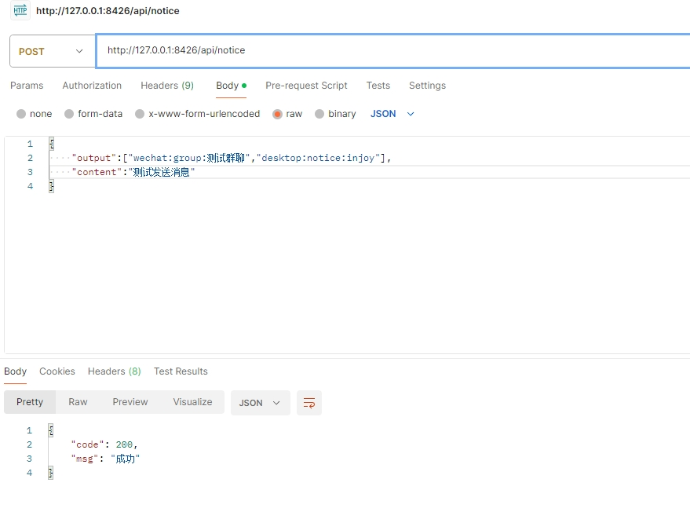
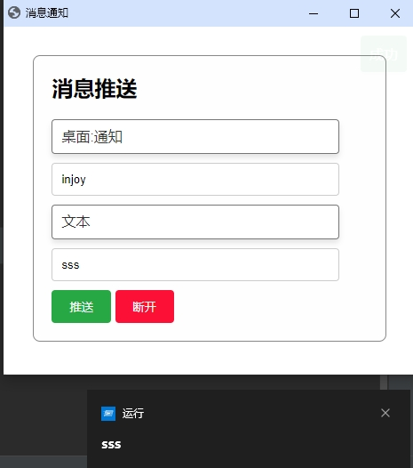

### 消息通知服务

#### 开发中...

- 把github上的推送项目聚合起来,前期先用自己的依赖库,后期完善成原生或者热门依赖库
- 用户管理(可选),涉及权限等
- 重试等操作可以通过中间件实现
- 各种各样的消息推送
- 微信好友,微信群聊,桌面通知,桌面语音,桌面弹窗,阿里云短信,钉钉,企业微信,Server酱,Gotify...

### 支持方式

| 推送方式         | 是否完成 | 测试通过 | 测试时间      | 备注                                    |
|--------------|------|------|-----------|---------------------------------------|
| 桌面端          | ✅    | ✅    | 2025-1-15 | 依赖: https://github.com/injoyai/ios    
| 钉钉           | ✅    |      |           | 官网: https://www.dingtalk.com          
| 飞书           |      |      |           | 官网: https://www.feishu.cn             
| Gotify       | ✅    | ✅    | 2025-1-16 | 依赖: https://github.com/gotify/server  
| 本机(windows)  | ✅    | ✅    | 2025-1-15 | 依赖: https://github.com/go-toast/toast 
| 邮件           | ✅    | ✅    | 2025-1-16 | 依赖: gopkg.in/gomail.v2                
| 手机厂商         |      |      |           | 依赖: https://github.com/modood/pushapi 
| Go插件         |      |      |           |
| PushPlus     | ✅    | ✅    | 2025-1-15 | 官网: https://www.pushplus.plus         
| Javascript脚本 | ✅    | ✅    | 2025-1-15 |
| Server酱      | ✅    | ✅    | 2025-1-15 | 官网: https://sct.ftqq.com              
| 短信           | ✅    | ✅    | 2025-1-15 |
| Telegram     | ✅    |      |           | 依赖: gopkg.in/telebot.v4               
| 语音           | ✅    |      |           |
| Webhook      | ✅    | ✅    | 2025-1-16 | 简易版本,后续改成通过脚本定义body                   |
| 微信           | ✅    | ✅    | 2025-1-15 | 非官方,可能会被限制,一个手机号能创建2个账号               |
| 企业微信         |      |      |           |

### 如何推送

1. 通过HTTP进行消息推送

- 
- 

2. 通过GUI(本质是TCP)推送,需要通过HTTP先添加用户先

- 